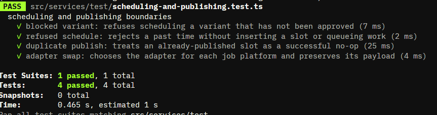
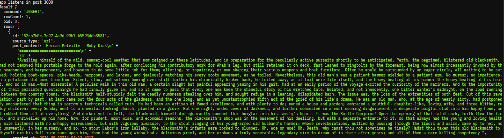

# BUILDLOG
## **Finalization [Sep 26, 2026\]**
* **About**:  
  * Create all neccesary documents and test cases
* **Where AI came in (Codex CLI)?**
  * Helped to generate test cases
## **Jest Test[Sep 22, 2026\]**
* **About**:  
  * Jest Test
* **Challenges**:
  * I dont have any experience in this service yet. I use Codex to generate the automated test using Jest. The lack of time in learning this sevice makes me lean towards using Codex. But will surely use this and learn it properly in the future.
* **Where AI came in (Codex CLI)?**
  * All passed
  * 
## **Changes to the Folder Structure[Sep 22, 2026\]**
* **About**:  
  * removed the frontend folder to left the mono repo approach
  
## **Idempotency [Sep 19-20, 2026\]**
* **About**:  
  * Implementation of Idempotency
* **Challenges**:
  * Struggles to simulate indempotency and test it in my project.
  * It took me a while to implement it since my sql implementation is getting larger and more complex. The files are also becoming larger which I get overhwelmed
* **Where AI came in (Antigravity CLI)?**
  * I used this model to help me generate the idempotency logic. What it did is it creates a [mock test](../src/services/publisher/idempotent-publish.test.ts) for my idempotency implementation.

## **Adapter and Discord webhook\[Sep 18, 2026\]**
* **About**:  
  * Implementation of Discord Webhook URL Adapter
* **Challenges**:
  * Creating adapter and understading how to implement it
* **Where AI came in (Gemini LLM)?**
  * Gave the blueprint functions on how to implement adapter in my project

## **Done WorkFlow[Sep 15, 2026\]**
* **About**:  
  * Actual flow is finish but doesnt adheres on the requirements yet.
  * Changes and improvements made to the worker and job bullmq.

## **Set Variant Status\[Sep 7 - 12, 2026\]**
* **About**:  
  * Updating variant Status, one variant one slot, and the addition of Bullmq for Job Queue.
* **Challenges**:
  * Understanding the architechture of how Bullmq works.
  * Implementing Advance Queries for updating variant status.
* **Where AI came in (Gemini LLM)?**
  * Used the model to help me understand the architechture of bullmq, i also used this documentation to better help me visualize it. For the [official documentatio](https://docs.bullmq.io/guide/introduction). 
  * I used the model to help me generate proper queries.

## **Set Variant Status\[Sep 4, 2026\]**
* **Goal**:  
  * create a route and query the database for variant status.
* **Challenges**:
  * For an alter set table, I had to write the validation for user parameters and check if the variant exists. Since I am spending much time on this project, I used Antigravity CLI again to help me generate the controller.
* **Where AI came in (Anti-Gravity CLI)?**
  * I used it to generate the [../src/backend/controller/variant.controller.ts](../src/backend/controller/variant.controller.ts) to handle the variant status logic. Though I am the one who made the SQL query. 
  * I might improve the generaed code in the future since I want to check if that specific variant exists first.
* **Problems that still need to be addressed**:
  * The validator only checks for the length and hashtags count, not the tone.
  * Improve the Variant Status Logic
  * Enhance request statuses for error handling.

## **Create a mock articles for testing\[Sep 4, 2026\]**
* **Goal**:  
  * Create a mock articles for testing.
* **Challenges**:
  * I can't find any blog posts that can be fetched without blocking me, so I had to create the blogs from scratch.
* **Where AI came in (Anti-Gravity CLI)?**
  * The [article.route.ts](../src/backend/routes/article.route.ts) was basically generated by Anti-Gravity CLI. the contents inside [article/](../src/backend/services/mock-articles) are actual blog content I pasted from there.
  * I can basically create a simple mock article router but I was too skeptical because it will took time and I feel like I had to finish this early on too comply with my other personal tasks. So I chose to generate the router using AGY CLI. Though I tweaked it a bit since the generated one was too bloated just for fetching the html file.
  
## **Store variants on database after generated \[Sep 4, 2026\]**
* **Goal**:  
  * After user enter the URL/markdown, store the original post and the variant.
* **Challenges**:
  * I struggled with planning on how can I store the variants and comply to the rules of postgresql.
  * I used the UNNEST feature of postgresql which took time. I convert all the generated variants into Array and pass it to a query so that I only query ONCE not multiple times per variant.
* **Where AI came in (Gemini ChatBot)?**
  * The AI helped me polish my code, since I got tumbled on multiple type complains.

## **Variant Generation and Validation using LLM (Gemini API) \[Sep 2, 2026\]**
* **Goal**:  
  * To successfully generate and validate variants using an LLM (Gemini API).
* **Challenges**:
  * I struggled with structuring the codebase and implementing the constraints.
  * Although the Gemini API provide the actual content, sometimes it generates less or much character than expected. Leading me to minimize the characters maximum and minimun constraint for each platform.
* **Where AI came in (Gemini ChatBot)?**
  * The AI helped me optimize the async calls on my "each variant genatator and validation function". My first attempt was calling them one by one asyncronously, but it feels unoptimized so I used it to help me refactor the code which at the end alsohelped me learn new things.

## **Store Markdown or URL \[Aug 30, 2026\]**
* **Goal**: 
  * To successfully store the content of the markdown/URL provided by the user.
* **Challenges**: 
  * Connecting to a database inside docker adds a bit of a challenge and some what a hassle.
* **Where AI came in (Gemini ChatBot)?**
  * It helped debug and guide me on setting up the compose.yaml properly for my db.
  * It introduced me to TurnDownService which converts the HTML into markdown to save tokens when generating variants through LLM.
* **Sample**
  * 

## **Setup docker + Initial routing for ingest + Setup publisher signature type \[Aug 29, 2026\]**
* **Goal**: To setup container for each project and connect it to a containariz
  * To set up a container for each projects and also to run postgres inside a container. 
  * Create a route for ingestion and the control function
  * Create a signature interface to visualize the data
* **Challenges**: 
  * Like in my previous log, it took me some time to think about what the publisher's initial signature could be, since I still don't have a clear picture of the input parameters and output object properties. The reason for this is that I haven't worked on this kind of project YET.
  *  I also encountered some challenges in setting up a compose.yaml for Docker and planning where I should set the Dockerfile in the project.
* **Where AI came in (Gemini ChatBot)?**
  * The initial interface for the [publisher's signature](../src/backend/services/publisher/publisher.types.ts) was generated by Gemini; it may be improved in the future. The initial interface is for reference.
  * It also helped me debug and improve my project structure, since I don't have that strong a foundation yet in making a monorepo project.

## **Setup Project Data Models + ER Diagram + Structure \[Aug 28, 2026\]**
* **Goal**: To define and understand the project needs for Data Model and Project Structure
* **Challenges**: 
  * I struggled on creating the schema and connecting the tables because I dont have the project's solid picture in my head yet. I do not have an ideas of what data should be in the fields.
  * The ER model that I made was just an initial model, this may change in the future if I hit some walls.
* **Where AI came in (Gemini ChatBot)?**
  * It helped me generate the ER model, what tables should be connected.
  * It also generated the fields for me, but I tweaked it a bit since some of the fields were unnecessary.
  * Problems on my postgres inside the docker, which was fixed by providing the right environments.
  * Helped on planning the project structure.
  * **INITIAL ER DIAGRAM**
    * 
        *This was created within supabase*
      * The Diagram was my initial revised version provided by the Gemini. The types is a bit misleading here since it is a mock fields for reference.  The connections are the same, although the schema may improve overtime. Check the schema [here](../src/backend/db/schemas)
