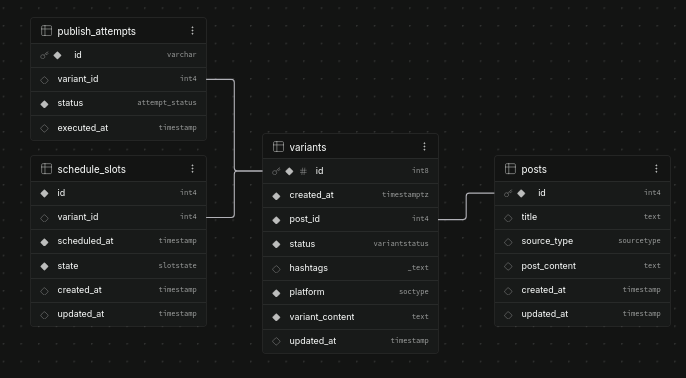

# BUILDOG
## **Setup docker + Initial routing for ingest + Setup publisher signature type \[Aug 29, 2026\]**
* **Goal**: To setup container for each project and connect it to a containariz
  * To set up a container for each projects and also to run postgres inside a container. 
  * Create a route for ingestion and the control function
  * Create a signature interface to visualize the data
* **Challenges**: 
  * Like in my previous log, it took me some time to think about what the publisher's initial signature could be, since I still don't have a clear picture of the input parameters and output object properties. The reason for this is that I haven't worked on this kind of project YET.
  *  I also encountered some challenges in setting up a compose.yaml for Docker and planning where I should set the Dockerfile in the project.
* **Where AI came in (Gemini ChatBot)?**
  * The initial interface for the publisher's signature was generated by Gemini; it may be improved in the future. The initial interface is for reference.
  * It also helped me debug and improve my project structure, since I don't have that strong a foundation yet in making a monorepo project.

## **Setup Project Data Models + ER Diagram + Structure \[Aug 28, 2026\]**
* **Goal**: To define and understand the project needs for Data Model and Project Structure
* **Challenges**: 
  * I struggled on creating the schema and connecting the tables because I dont have the project's solid picture in my head yet. I do not have an ideas of what data should be in the fields.
  * The ER model that I made was just an initial model, this may change in the future if I hit some walls.
* **Where AI came in (Gemini ChatBot)?**
  * It helped me generate the ER model, what tables should be connected.
  * It also generated the fields for me, but I tweaked it a bit since some of the fields were unnecessary.
  * Problems on my postgres inside the docker, which was fixed by providing the right environments.
  * Some help on planning the project structure.
  * **INITIAL ER DIAGRAM**
    * 
       *This was created within supabase*
      * The Diagram was my initial revised version provided by the Gemini. The types is a bit misleading here since it is a mock fields for reference.  The connections are the same, although the schema may improve overtime. Check the schema [here](../src/backend/db/schemas)
