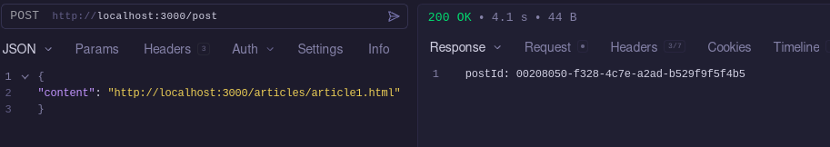
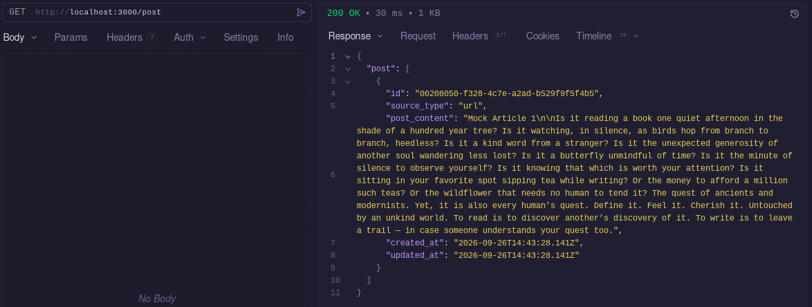
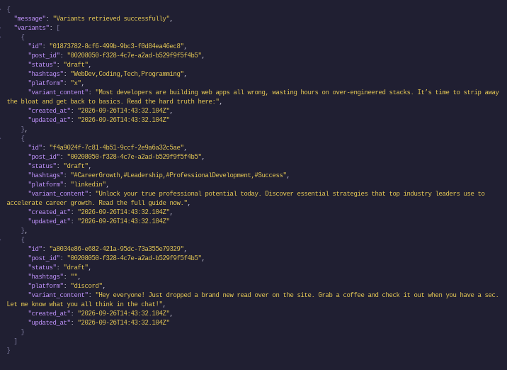
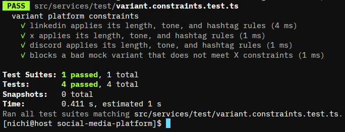
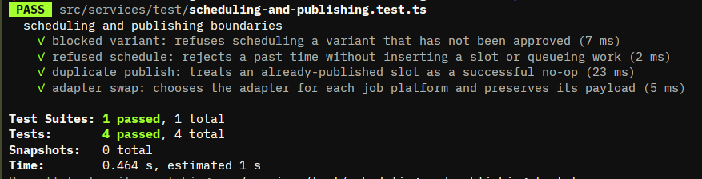
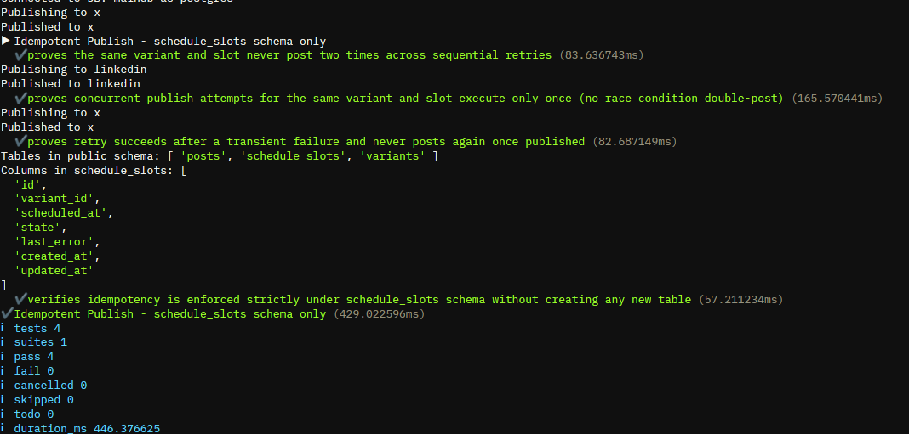
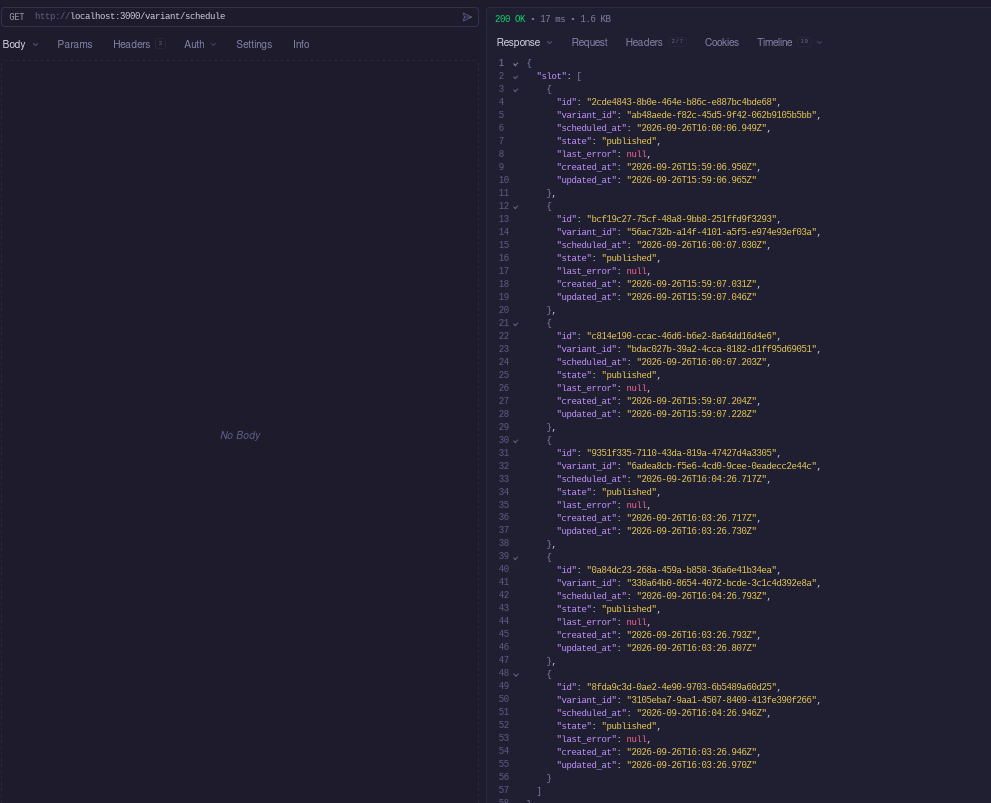

# Evidence  
## **Ingestion**: 
A post enters as a URL or as Markdown, and is stored. Generation reads only the stored post.

## **Constraints**: 
length, tone rules, and hashtag count per platform. A test proves that a badvariant is blocked
  * `npm run test:constraints`  

## **1 test 4 boxes**: 
blocked variant, refused schedule, duplicate publish, adapter swap
  * `npm run test:services`  

## **Idempotent publish** : 
the same variant and slot never post two times, even under retries. A test proves it.
  * `npm run test:idempotent`  
  * 
## **Publish History**:
  * `GET /variant/schedule`  
  * 
## **SecretClean and README.md**:
  * check [readme.md](../README.md) and [env.example](../.env.example)
